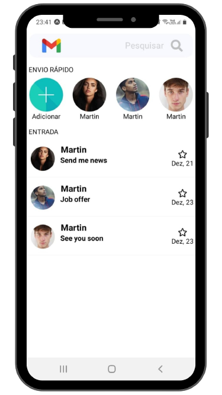
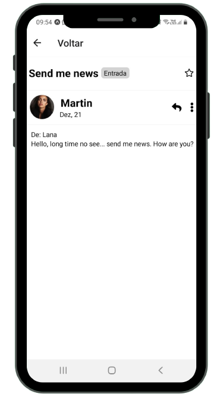

# Email clone

> O projeto consiste em um aplicativo mobile para dispositivos android, onde imita as funcionalidades do Email.

## Vídeo explicativo (em breve)
[Clique](#)

### Ajustes e melhorias

O projeto ainda está em desenvolvimento e as próximas atualizações serão voltadas nas seguintes tarefas:

- [x] Caixa de entrada
- [x] Conexão com servidor
- [x] Página de Leitura
- [x] Vídeo explicativo
- [ ] Página de Envio
- [ ] Deixar 100% funcional

## 📫 Contribuindo para *Email Clone*

Para contribuir com Email Clone, siga estas etapas:

1. Bifurque este repositório.
2. Crie um branch: `git checkout -b <nome_branch>`.
3. Faça suas alterações e confirme-as: `git commit -m '<mensagem_commit>'`
4. Envie para o branch original: `git push origin <nome_do_projeto> / <local>`
5. Crie a solicitação de pull.

Como alternativa, consulte a documentação do GitHub em [como criar uma solicitação pull](https://help.github.com/en/github/collaborating-with-issues-and-pull-requests/creating-a-pull-request).

## 🤝 Colaboradores

Agradecemos às seguintes pessoas que contribuíram para este projeto:

<table>
  <tr>
    <td align="center">
      <a href="https://github.com/lucasgf007">
         
        
          <b>Lucas Gabriel</b>
        
      </a>
    </td>
  </tr>
</table>